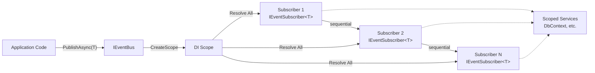
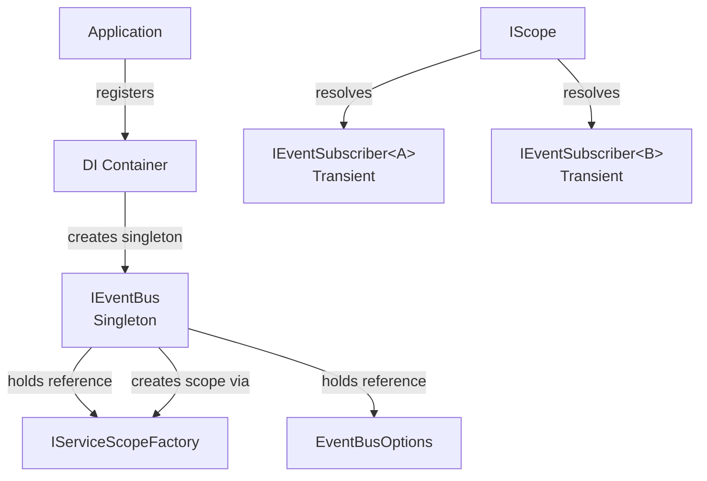
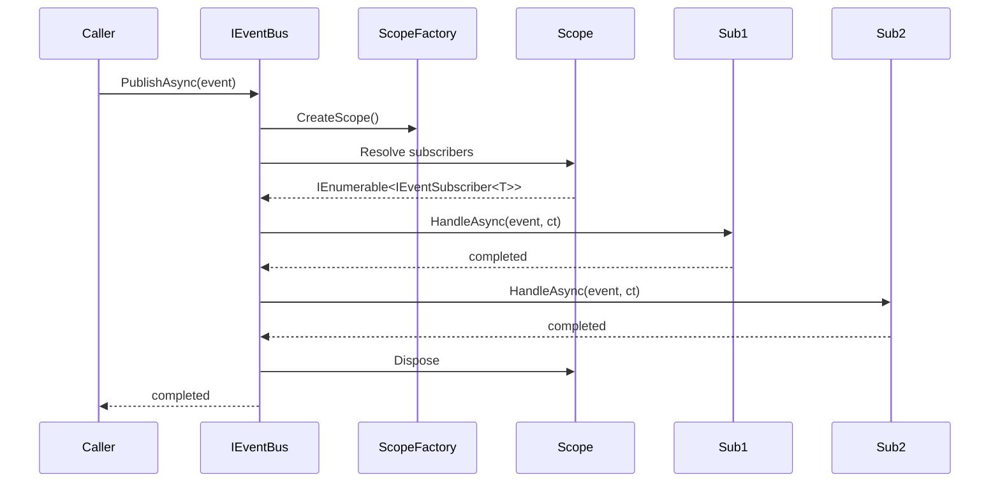

# Architecture

## Overview

LiteEventBus implements the **Publish/Subscribe** pattern entirely in-memory. It is not a message broker, command bus, or Mediator — it is a lightweight dispatcher that delivers strongly-typed events to registered subscribers.

The library consists of four logical layers:

```
┌──────────────────────────────────────────────────┐
│                  Consumer Code                    │
│   (Event types, Subscribers, Host application)   │
├──────────────────────────────────────────────────┤
│              Public API (Abstractions)            │
│   IEventBus · IEventSubscriber<T> · PublishOpts  │
├──────────────────────────────────────────────────┤
│               DI Integration Layer                │
│   ServiceCollectionExtensions                     │
│   (AddLiteEventBus, AddSubscriber overloads)      │
├──────────────────────────────────────────────────┤
│               Internal Implementation             │
│   DefaultEventBus · DelegateSubscriber            │
│   (Scope management, dispatch, error handling)    │
└──────────────────────────────────────────────────┘
```

---

## Architecture Diagram



---

## Module Responsibilities

### `IEventBus` (Abstractions)

The public contract for publishing events. Defines two `PublishAsync` overloads — one with per-call options, one without. Consumers depend on this interface, never on the implementation.

### `IEventSubscriber<TEvent>` (Abstractions)

The public contract for event handlers. Consumers implement this interface to react to events. Single method: `HandleAsync(TEvent, CancellationToken)`.

### `PublishOptions` (Abstractions)

A per-call configuration object passed to `PublishAsync`. Currently exposes `ContinueOnError` to control error propagation behavior.

### `EventBusOptions`

Global configuration for the entire event bus instance. Set once at registration time via `AddLiteEventBus(Action<EventBusOptions>)`.

### `ServiceCollectionExtensions`

The DI integration layer. Registers:

- `IEventBus` as **singleton**.
- `IEventSubscriber<TEvent>` implementations as **transient**.
- `DelegateSubscriber<TEvent>` wrappers for lambda-based subscribers.

All methods are idempotent where appropriate.

### `DefaultEventBus` (Internal)

The singleton implementation of `IEventBus`. On each `PublishAsync` call:

1. Creates a DI scope via `IServiceScopeFactory`.
2. Resolves all `IEventSubscriber<TEvent>` registrations from the scope.
3. Iterates sequentially, calling `HandleAsync` on each.
4. Handles error policy (fail-fast vs. continue-on-error).
5. Disposes the scope.

### `DelegateSubscriber<TEvent>` (Internal)

An internal adapter that wraps `Func<TEvent, CancellationToken, Task>` delegates as `IEventSubscriber<TEvent>` instances. Enables lambda-based registration without requiring a concrete class.

---

## Dependency Flow



---

## Publish Lifecycle



If a subscriber throws and `ContinueOnError` is `false`, the sequence stops at the failing subscriber and re-throws immediately. The scope is still disposed.

---

## Design Rationale

### Sequential execution

Subscribers are executed one at a time in registration order. This avoids concurrency issues within a single event and preserves ordering guarantees. Concurrent publishes of **different** events run in parallel without interference.

### DI scope per publish

Each `PublishAsync` creates a dedicated scope rather than using the root container. This ensures:

- Subscribers can depend on scoped services (`DbContext`, `HttpContext`, `UnitOfWork`).
- Transient subscribers are isolated per publish.
- Scoped resources are disposed after publish completes.
- No service locator pattern is required in subscriber code.

### Singleton event bus

The `IEventBus` itself is stateless (no mutable shared state). Registering as singleton is safe, efficient, and allows the bus to be injected anywhere.

### No reflection in the critical path

Subscriber resolution is done entirely through DI's built-in `IEnumerable<T>` support. No `dynamic`, `Activator`, or runtime type inspection occurs when publishing. This keeps the per-publish overhead minimal.

### Zero-configuration defaults

The library works out of the box with just `services.AddLiteEventBus()`. Configuration is additive and only needed for custom error handling.

### Thread safety

The `DefaultEventBus` holds no mutable state. Concurrent `PublishAsync` calls are safe because:

- No shared state is modified during publish.
- Each call creates an independent scope.
- Subscriber instances are resolved per-call (transient).

---

## Extension Points

| Point | Mechanism | Description |
|-------|-----------|-------------|
| Custom subscribers | `IEventSubscriber<TEvent>` | Implement the interface to handle events |
| Lambda subscribers | `AddSubscriber<TEvent>(Func<...>)` | Register inline handlers without a class |
| Error callbacks | `EventBusOptions.OnSubscriberError` | React to subscriber failures |
| Wrapping `IEventBus` | Decorator pattern | Add cross-cutting concerns (logging, metrics, retry) by decorating `IEventBus` |
